Seattle, Washington

> Paper plugins, from Seattle.

I write Minecraft plugins for live servers — packet-level player 
capture and sprites in chat.

<samp>java &nbsp; kotlin &nbsp; python &nbsp; typescript &nbsp; paper &nbsp; protocollib &nbsp; docker &nbsp; git</samp>

**[Mocap](https://github.com/CaptainParis/Mocap)** &nbsp;·&nbsp; <samp>java, paper</samp> 
Record a player and the chunks around them, then replay the take as 
packet actors — ProtocolLib entities, not NPCs or fake players.

**[HeadSprites](https://github.com/CaptainParis/HeadSprites)** &nbsp;·&nbsp; <samp>java, paper</samp> 
Draw an 8×8 sprite or paste an image. MineSkin signs a head, and 
<code>&lt;head:heart&gt;</code> puts it in chat. No resource pack. Paper 1.21.9+.

Every graphic is generated in this repo, not loaded from someone else's server. 
Portrait from a photo; stats from the GitHub API, once a day.
