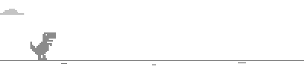

   

### Popular repositories

- **[Mocap](https://github.com/CaptainParis/Mocap)** — record a player and the world around them, replay the take as packet actors.
- **[HeadSprites](https://github.com/CaptainParis/HeadSprites)** — custom head sprites inline in chat, no resource pack.
